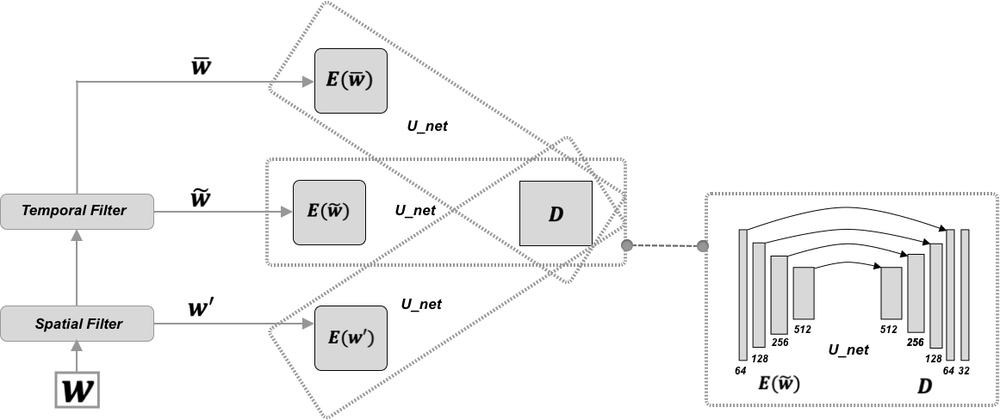

## Towards Physics-informed Deep Learning for Turbulent Flow Prediction
## Paper: 
Rui Wang, Karthik Kashinath, Mustafa Mustafa, Adrian Albert, Rose Yu [Towards Physics-informed Deep Learning for Turbulent Flow Prediction](https://ucsdml.github.io/jekyll/update/2020/08/23/TF-Net.html), KDD 2020

## [DataSet](https://drive.google.com/drive/folders/1VOtLjfAkCWJePiacoDxC-nrgCREKvrpE?usp=sharing.)
2000 velocity fields ()

### Abstract:
While deep learning has shown tremendous success in a wide range of domains, it remains a grand challenge to incorporate physical principles in a systematic manner to the design, training, and inference of such models. In this paper, we aim to predict turbulent flow by learning its highly nonlinear dynamics from spatiotemporal velocity fields of large-scale fluid flow simulations of relevance to turbulence modeling and climate modeling. We adopt a hybrid approach by marrying two well-established turbulent flow simulation techniques with deep learning. Specifically, we introduce trainable spectral filters in a coupled model of Reynolds-averaged Navier-Stokes (RANS) and Large Eddy Simulation (LES), followed by a specialized U-net for prediction. Our approach, which we call turbulent-Flow Net (TF-Net), is grounded in a principled physics model, yet offers the flexibility of learned representations. We compare our model, TF-Net, with state-of-the-art baselines and observe significant reductions in error for predictions 60 frames ahead. Most importantly, our method predicts physical fields that obey desirable physical characteristics, such as conservation of mass, whilst faithfully emulating the turbulent kinetic energy field and spectrum, which are critical for accurate prediction of turbulent flows.

### Model Architecture



### Velocity U & V Prediction and Ablation Study


## Description of Files
1. run_model.py : script to train TF-Net
2. models/: 
   1. baselines: six baseline modules included in the paper.
   2. penalty.py: Divergence-free regularizer.
   3. model.py: Pytorch implementation of TF-Net
3. utils:
   1. train_utils.py: data loaders, train epoch, validation epoch, test epoch functions
   2. eval_utils.py: evaluation functions for computing divergence and energy spectrum. 
4. notebooks: Code to generate plots in the paper.
5. videos: videos of velocity u, v predictions and ablation study.


## Requirements
- To install requirements
```
pip install -r requirements.txt
```


## Instructions
### Dataset and Preprocessing
- Download rbc_data.pt from [google drive](https://drive.google.com/drive/folders/1VOtLjfAkCWJePiacoDxC-nrgCREKvrpE?usp=sharing.)

- run data_prep.py to preprocess the raw data and all samples will be saved in the "rbc_data" folder
```
python data_gen.py
```

### Training
- Train TF-Net.
```
python3 run_model.py --time_range=6 --output_length=6 --input_length=26 --batch_size=64 --learning_rate=0.005 --decay_rate=0.9 --coef=0.001 --seed=0
```

## Cite
```
@article{Wang2020TF,
   title={Towards Physics-informed Deep Learning for Turbulent Flow Prediction},
   author={Rui Wang, Karthik Kashinath, Mustafa Mustafa, Adrian Albert, Rose Yu},
   journal={Proceedings of the 26th ACM SIGKDD International Conference on Knowledge Discovery & Data Mining},
   Year = {2020}
}	
```
